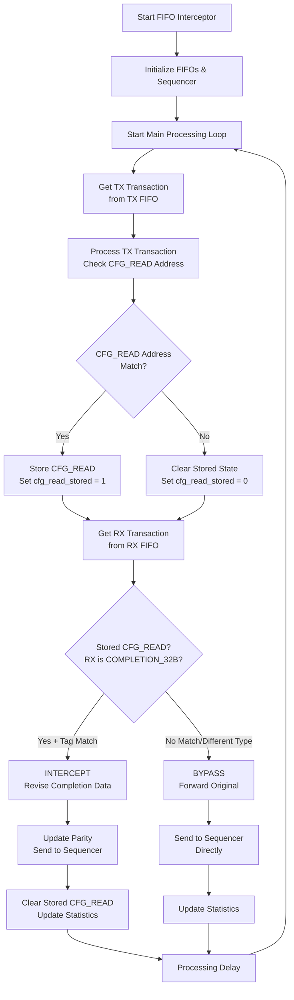
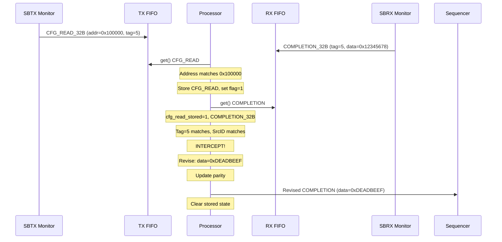
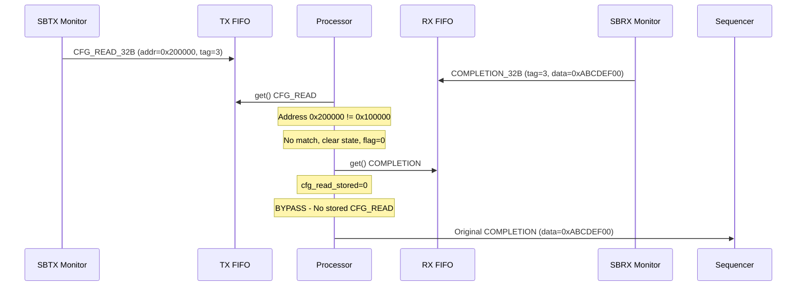
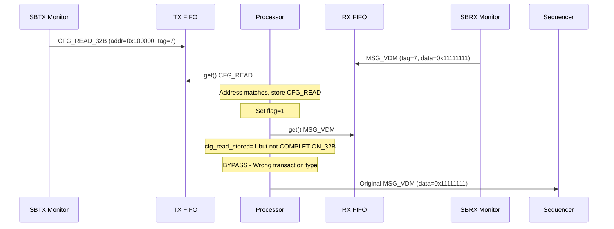

# UCIe Sideband FIFO-Based Transaction Interceptor - Flow Chart

## 🏗️ **FIFO-Based Interceptor Architecture**

### **📦 Component Architecture**

```mermaid
flowchart TD
    subgraph "Input Sources"
        A1[SBTX Monitor] --> A2[SBTX AP Port]
        B1[SBRX Monitor] --> B2[SBRX AP Port]
    end
    
    subgraph "FIFO Interceptor Component"
        A2 --> C1[write_sbtx()]
        B2 --> C2[write_sbrx()]
        
        C1 --> D1[TX FIFO<br/>uvm_tlm_fifo]
        C2 --> D2[RX FIFO<br/>uvm_tlm_fifo]
        
        E1[Main Processing Loop<br/>process_transactions()] --> D1
        E1 --> D2
        
        D1 --> F1[process_tx_transaction()]
        D2 --> F2[process_rx_transaction()]
        
        F1 --> G1[Stored Transaction<br/>stored_cfg_read]
        F2 --> G2{CFG_READ Stored?<br/>COMPLETION_32B?}
        
        G2 -->|Yes + Match| H1[revise_completion()<br/>Update Data & Parity]
        G2 -->|No Match| H2[Bypass Original]
        
        H1 --> I1[send_to_sequencer()]
        H2 --> I1
    end
    
    subgraph "Output"
        I1 --> J1[SBRX Sequencer]
        J1 --> J2[SBRX Driver]
        J2 --> J3[DUT/Interface]
    end
```

---

## 🔄 **Main Processing Flow**

### **📊 FIFO-Based Transaction Flow**



---

## 📊 **Detailed Component Flow**

### **📋 TX FIFO Processing**

```mermaid
flowchart TD
    A[SBTX AP Port<br/>write_sbtx()] --> B[Receive TX Transaction]
    B --> C[Update Statistics<br/>tx_transactions_received++]
    C --> D[Debug Logging<br/>if enabled]
    D --> E{TX FIFO<br/>Available?}
    
    E -->|Yes| F[Push to TX FIFO<br/>tx_fifo.try_put()]
    E -->|No| G[ERROR: FIFO Full<br/>Drop Transaction]
    
    F --> H[TX Transaction<br/>Available for Processing]
    
    subgraph "Processing Loop"
        I[tx_fifo.get()] --> J{Transaction Type?}
        J -->|CFG_READ_32B| K[Check Address Match]
        J -->|Other Types| L[Clear Stored State]
        
        K --> M{Address Match?}
        M -->|Yes| N[stored_cfg_read = tx_trans.copy()<br/>cfg_read_stored = 1<br/>cfg_reads_matched++]
        M -->|No| O[cfg_read_stored = 0<br/>stored_cfg_read = null<br/>cfg_reads_ignored++]
        
        L --> P[cfg_read_stored = 0<br/>stored_cfg_read = null]
    end
    
    H --> I
```

### **📋 RX FIFO Processing**

```mermaid
flowchart TD
    A[SBRX AP Port<br/>write_sbrx()] --> B[Receive RX Transaction]
    B --> C[Update Statistics<br/>rx_transactions_received++]
    C --> D[Debug Logging<br/>if enabled]
    D --> E{RX FIFO<br/>Available?}
    
    E -->|Yes| F[Push to RX FIFO<br/>rx_fifo.try_put()]
    E -->|No| G[ERROR: FIFO Full<br/>Drop Transaction]
    
    F --> H[RX Transaction<br/>Available for Processing]
    
    subgraph "Processing Loop"
        I[rx_fifo.get()] --> J{cfg_read_stored?<br/>COMPLETION_32B?}
        
        J -->|Yes| K{Tag Match?<br/>SrcID Match?}
        J -->|No| L[BYPASS<br/>Send Original to Sequencer]
        
        K -->|Yes| M[INTERCEPT<br/>Generate Revised Completion]
        K -->|No| N[BYPASS<br/>Send Original to Sequencer]
        
        M --> O[revise_completion()<br/>Custom Data + Update Parity]
        O --> P[send_to_sequencer()<br/>completions_intercepted++]
        P --> Q[Clear Stored State<br/>cfg_read_stored = 0]
        
        N --> R[send_to_sequencer()<br/>completions_bypassed++]
        L --> S{Transaction Type?}
        S -->|COMPLETION_32B| T[completions_bypassed++]
        S -->|Other| U[other_transactions_bypassed++]
        T --> V[send_to_sequencer()]
        U --> V
    end
    
    H --> I
```

---

## 🎯 **Transaction Matching Logic**

### **🔍 CFG_READ Address Matching**

```mermaid
flowchart TD
    A[TX Transaction<br/>from FIFO] --> B{Opcode ==<br/>CFG_READ_32B?}
    
    B -->|No| C[Clear Stored State<br/>Continue Processing]
    B -->|Yes| D[Extract Address<br/>trans.addr]
    
    D --> E{Address Matching<br/>Enabled?}
    E -->|No| F[Always Match<br/>Store CFG_READ]
    E -->|Yes| G[Apply Address Mask<br/>(addr & mask) == (base & mask)]
    
    G --> H{Address Match?}
    H -->|Yes| I[✅ STORE CFG_READ<br/>stored_cfg_read = trans.copy()]
    H -->|No| J[❌ IGNORE CFG_READ<br/>Clear stored state]
    
    I --> K[Set Flag<br/>cfg_read_stored = 1]
    K --> L[Update Statistics<br/>cfg_reads_matched++]
    
    J --> M[Clear Flag<br/>cfg_read_stored = 0]
    M --> N[Update Statistics<br/>cfg_reads_ignored++]
    
    F --> I
    L --> O[Continue to RX Processing]
    N --> O
    C --> O
```

### **🎯 COMPLETION Interception Logic**

```mermaid
flowchart TD
    A[RX Transaction<br/>from FIFO] --> B{cfg_read_stored<br/>== 1?}
    
    B -->|No| C[BYPASS<br/>No Stored CFG_READ]
    B -->|Yes| D{Opcode ==<br/>COMPLETION_32B?}
    
    D -->|No| E[BYPASS<br/>Not a Completion]
    D -->|Yes| F[Check Tag Match<br/>rx.tag == stored.tag]
    
    F --> G{Tag Match?}
    G -->|No| H[BYPASS<br/>Tag Mismatch]
    G -->|Yes| I[Check SrcID Match<br/>rx.srcid == stored.dstid]
    
    I --> J{SrcID Match?}
    J -->|No| H
    J -->|Yes| K[🎯 INTERCEPT<br/>Perfect Match Found]
    
    K --> L[Create Revised Completion<br/>revised = original.copy()]
    L --> M{Error Mode?}
    
    M -->|Yes| N[Set Error Status<br/>revised.status = error_status<br/>revised.data = 32'h0]
    M -->|No| O[Set Custom Data<br/>revised.status = success<br/>revised.data = custom_data]
    
    N --> P{Auto Update<br/>Parity?}
    O --> P
    
    P -->|Yes| Q[Update Packet Info<br/>revised.update_packet_info()]
    P -->|No| R[Keep Original Parity]
    
    Q --> S[Send to Sequencer<br/>completions_intercepted++]
    R --> S
    S --> T[Clear Stored State<br/>cfg_read_stored = 0]
    
    C --> U[Send Original<br/>other_transactions_bypassed++]
    E --> U
    H --> V[Send Original<br/>completions_bypassed++]
    
    U --> W[Continue Processing]
    V --> W
    T --> W
```

---

## 📊 **Transaction Flow Examples**

### **Example 1: Successful Interception**



### **Example 2: Address Mismatch - Bypass**



### **Example 3: Non-COMPLETION Transaction - Bypass**



---

## 📈 **Statistics and Performance Monitoring**

### **📊 Counter Updates**

| Event | Counter | Description |
|-------|---------|-------------|
| **TX AP Write** | `tx_transactions_received++` | All TX transactions received |
| **RX AP Write** | `rx_transactions_received++` | All RX transactions received |
| **CFG_READ Match** | `cfg_reads_matched++` | CFG_READs that matched address |
| **CFG_READ No Match** | `cfg_reads_ignored++` | CFG_READs that didn't match |
| **COMPLETION Intercepted** | `completions_intercepted++` | COMPLETION_32B intercepted and revised |
| **COMPLETION Bypassed** | `completions_bypassed++` | COMPLETION_32B forwarded unchanged |
| **Other Bypassed** | `other_transactions_bypassed++` | All other transaction types |

### **🔧 Configuration Parameters**

```systemverilog
// Address matching
bit [23:0] cfg_read_addr_base = 24'h100000;  // Base address
bit [23:0] cfg_read_addr_mask = 24'hFFF000;  // 4KB mask

// Custom completion
bit [31:0] custom_completion_data = 32'hDEADBEEF;
bit auto_update_parity = 1;

// FIFO configuration
int tx_fifo_size = 16;
int rx_fifo_size = 16;
```

---

## 🎯 **Key Advantages of FIFO-Based Architecture**

### **✅ Benefits**

1. **🔄 Decoupled Processing**: FIFOs decouple input collection from processing
2. **📊 Buffering**: Handles burst traffic and timing mismatches
3. **🎯 Sequential Processing**: Ensures proper TX→RX transaction pairing
4. **⚡ Performance**: Non-blocking FIFO operations with try_put()
5. **🔧 Configurable**: Adjustable FIFO sizes and processing delays
6. **📈 Observable**: Comprehensive statistics and debug logging
7. **🛡️ Robust**: Error handling for FIFO overflow conditions

### **🏗️ Architecture Features**

- **Analysis Port Integration**: Standard UVM analysis port connectivity
- **TLM FIFO Usage**: Leverages UVM TLM infrastructure
- **Sequencer Output**: Integrates with existing UVM sequencer/driver flow
- **State Management**: Simple stored transaction with clear lifecycle
- **Parity Updates**: Automatic parity recalculation after data modification

This FIFO-based architecture provides a robust, scalable solution for UCIe sideband transaction interception with clear separation of concerns and excellent observability.