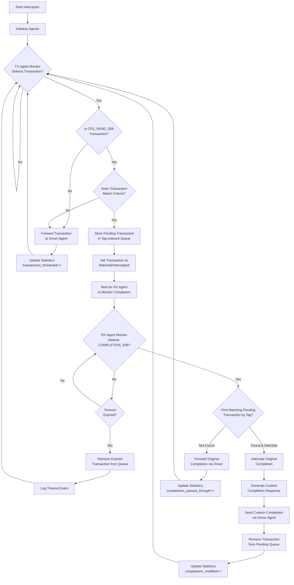
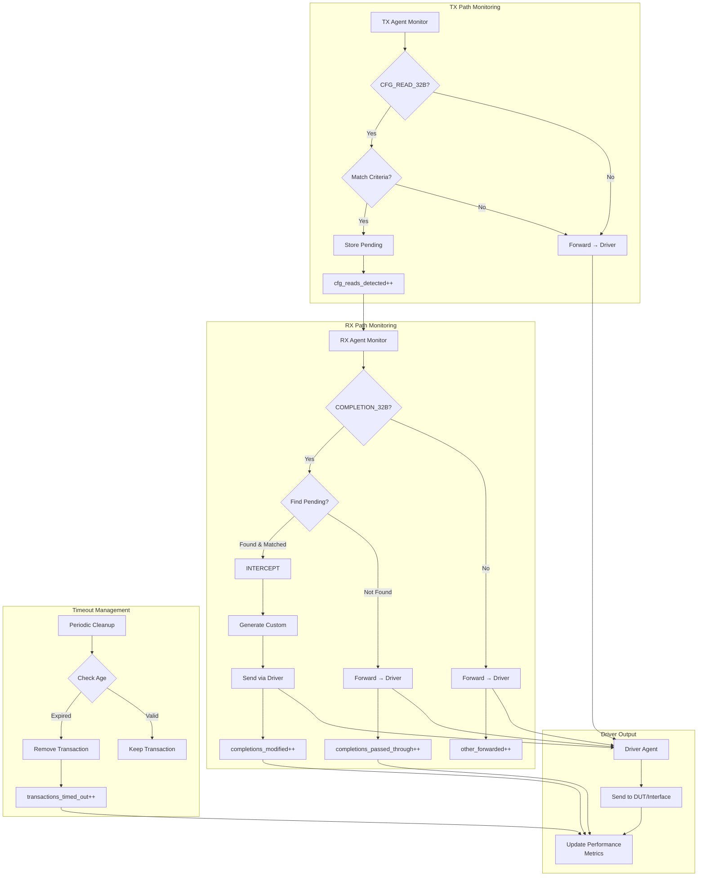
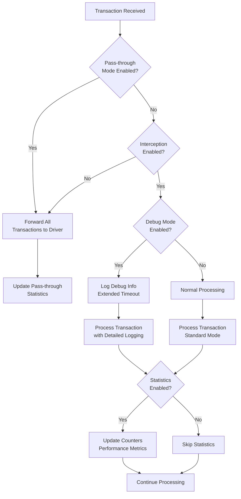
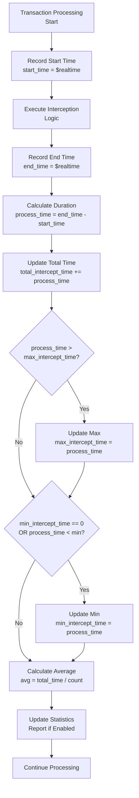

# UCIe Sideband Transaction Interceptor - Flow Chart

## 🔄 **Transaction Interceptor Decision Flow**

### **📊 Main Flow Chart**



---

## 🔍 **Detailed Decision Logic**

### **📋 TX Agent Monitoring Flow**

```mermaid
flowchart TD
    A[TX Agent Monitor<br/>Receives Transaction] --> B{Transaction Type<br/>Check}
    
    B -->|CFG_READ_32B| C[Extract Transaction<br/>Details]
    B -->|Other Types| D[Forward to<br/>Driver Agent]
    
    C --> E[Check Matching<br/>Criteria]
    E --> F{Address Match?}
    
    F -->|Yes| G{Source ID Match?}
    F -->|No| H[Forward to<br/>Driver Agent]
    
    G -->|Yes| I{Tag Match?}
    G -->|No| H
    
    I -->|Yes| J[Create Pending<br/>Transaction Entry]
    I -->|No| H
    
    J --> K[Store in Tag-indexed<br/>Queue: pending_queue[tag]]
    K --> L[Add to Sequential<br/>List: pending_transactions[]]
    L --> M[Set matched = 1<br/>timestamp = $realtime]
    M --> N[Trigger Event:<br/>new_cfg_read_event]
    
    H --> O[Statistics:<br/>transactions_forwarded++]
    N --> P[Statistics:<br/>cfg_reads_detected++]
```

---

### **📋 RX Agent Monitoring Flow**

```mermaid
flowchart TD
    A[RX Agent Monitor<br/>Receives Transaction] --> B{Transaction Type<br/>Check}
    
    B -->|COMPLETION_32B| C[Extract Completion<br/>Details: tag, srcid]
    B -->|Other Types| D[Forward to<br/>Driver Agent]
    
    C --> E[Lookup Pending Transaction<br/>pending_queue[tag]]
    E --> F{Pending Transaction<br/>Found?}
    
    F -->|No| G[Forward Original<br/>Completion to Driver]
    F -->|Yes| H{Source ID<br/>Matches?}
    
    H -->|No| G
    H -->|Yes| I{Transaction<br/>Marked as Matched?}
    
    I -->|No| G
    I -->|Yes| J[INTERCEPT<br/>Original Completion]
    
    J --> K[Generate Custom<br/>Completion Response]
    K --> L[Set Custom Data:<br/>cfg.custom_completion_data]
    L --> M[Set Custom Status:<br/>cfg.custom_completion_status]
    M --> N[Swap Source/Destination<br/>IDs for Response]
    N --> O[Send Custom Completion<br/>via Driver Agent]
    
    O --> P[Remove from<br/>pending_queue[tag]]
    P --> Q[Remove from<br/>pending_transactions[]]
    Q --> R[Update Statistics<br/>completions_modified++]
    
    G --> S[Update Statistics<br/>completions_passed_through++]
    D --> T[Update Statistics<br/>other_transactions_forwarded++]
```

---

## 🎯 **Matching Criteria Decision Tree**

```mermaid
flowchart TD
    A[CFG_READ_32B<br/>Transaction Received] --> B{Address Matching<br/>Enabled?}
    
    B -->|No| C{Source ID Matching<br/>Enabled?}
    B -->|Yes| D{Address in Range?<br/>(addr & mask) == (base & mask)}
    
    D -->|No| E[❌ No Match<br/>Forward Transaction]
    D -->|Yes| C
    
    C -->|No| F{Tag Matching<br/>Enabled?}
    C -->|Yes| G{Source ID Match?<br/>srcid == match_srcid}
    
    G -->|No| E
    G -->|Yes| F
    
    F -->|No| H[✅ Match Found<br/>Store as Pending]
    F -->|Yes| I{Tag in Range?<br/>(tag & mask) == (base & mask)}
    
    I -->|No| E
    I -->|Yes| H
    
    H --> J[Create Pending Entry:<br/>tag, srcid, dstid, addr, be]
    J --> K[Set matched = 1<br/>timestamp = $realtime]
    K --> L[Store in pending_queue[tag]]
    L --> M[Add to pending_transactions[]]
```

---

## ⏰ **Timeout Management Flow**

```mermaid
flowchart TD
    A[Timeout Cleanup Task<br/>Periodic Execution] --> B[Iterate Through<br/>pending_transactions[]]
    
    B --> C{More Transactions<br/>to Check?}
    C -->|No| D[Wait for Next<br/>Cleanup Cycle]
    C -->|Yes| E[Get Next Transaction<br/>pending_transactions[i]]
    
    E --> F[Check Age:<br/>$realtime - timestamp]
    F --> G{Age > Timeout<br/>Threshold?}
    
    G -->|No| H[Continue to<br/>Next Transaction]
    G -->|Yes| I[Remove from<br/>pending_queue[tag]]
    
    I --> J[Remove from<br/>pending_transactions[i]]
    J --> K[Update Statistics<br/>transactions_timed_out++]
    K --> L[Log Timeout Event<br/>if Debug Enabled]
    
    L --> H
    H --> C
    D --> A
```

---

## 📊 **Complete System Flow with Statistics**



---

## 🔧 **Configuration-Based Flow Control**



---

## 📈 **Performance Monitoring Flow**



---

## 🎯 **Key Decision Points Summary**

| Decision Point | Condition | Action | Statistics Updated |
|----------------|-----------|--------|-------------------|
| **TX Monitor** | Non-CFG_READ | Forward to Driver | `transactions_forwarded++` |
| **TX Monitor** | CFG_READ + No Match | Forward to Driver | `cfg_reads_detected++` |
| **TX Monitor** | CFG_READ + Match | Store Pending | `cfg_reads_detected++` |
| **RX Monitor** | Non-COMPLETION | Forward to Driver | `other_forwarded++` |
| **RX Monitor** | COMPLETION + No Pending | Forward to Driver | `completions_passed_through++` |
| **RX Monitor** | COMPLETION + Pending Match | Intercept & Generate Custom | `completions_modified++` |
| **Timeout** | Expired Transaction | Remove from Queue | `transactions_timed_out++` |

---

This flow chart provides a complete visual representation of the transaction interceptor's decision logic, showing exactly when transactions are intercepted versus passed through, and how the system maintains performance statistics throughout the process.