# UCIe Sideband Transaction Interceptor - Revised Flow Chart

## 🔄 **Corrected Transaction Interceptor Logic**

### **📊 Main Interceptor Flow Chart**


---

## 🔍 **Detailed Transaction Processing Logic**

### **📋 TX Agent - CFG_READ Detection Only**


---

### **📋 RX Agent - All Transaction Processing**

```mermaid
flowchart TD
    A[RX Agent Monitor<br/>Receives Any Transaction] --> B{Transaction Type?}
    
    B -->|COMPLETION_32B| C[Process COMPLETION]
    B -->|All Other Types| D[BYPASS - Forward Directly<br/>to Driver Agent]
    
    C --> E{Interception Ready?<br/>ready_for_completion == true}
    E -->|No| F[Forward Original COMPLETION<br/>to Driver Agent]
    E -->|Yes| G{Tags Match?<br/>completion.tag == latest_cfg_read.tag}
    
    G -->|No| F
    G -->|Yes| H{Source IDs Match?<br/>completion.srcid == latest_cfg_read.dstid}
    
    H -->|No| F
    H -->|Yes| I[🎯 INTERCEPT COMPLETION_32B]
    
    I --> J[Create Revised COMPLETION]
    J --> K[Set Custom Data:<br/>custom_completion_data]
    K --> L[Set Custom Status:<br/>custom_completion_status]
    L --> M[Preserve UCIe Fields:<br/>tag, srcid→dstid, dstid→srcid]
    M --> N[Send Revised COMPLETION<br/>to Driver Agent]
    
    N --> O[Clear Interception State:<br/>ready_for_completion = false]
    O --> P[Clear Latest CFG_READ:<br/>latest_cfg_read = null]
    P --> Q[Update Statistics:<br/>completions_intercepted++]
    
    F --> R[Update Statistics:<br/>completions_bypassed++]
    D --> S[Update Statistics:<br/>other_transactions_bypassed++]
    
    Q --> T[Continue RX Monitoring]
    R --> T
    S --> T
    T --> A
```



---

## 🎯 **Simplified System Architecture**

```mermaid
flowchart LR
    subgraph "TX Path"
        A1[TX Agent Monitor] --> A2{CFG_READ_32B?}
        A2 -->|Yes| A3{Match Criteria?}
        A2 -->|No| A4[Ignore]
        A3 -->|Yes| A5[Store Latest Match<br/>Set Ready Flag]
        A3 -->|No| A4
    end
    
    subgraph "RX Path"
        B1[RX Agent Monitor] --> B2{COMPLETION_32B?}
        B2 -->|No| B3[BYPASS → Driver]
        B2 -->|Yes| B4{Ready Flag Set?}
        B4 -->|No| B5[Forward → Driver]
        B4 -->|Yes| B6[INTERCEPT<br/>Revise & Send]
    end
    
    subgraph "Output"
        C1[Driver Agent] --> C2[DUT Interface]
    end
    
    A5 -.->|Set Flag| B4
    B3 --> C1
    B5 --> C1
    B6 --> C1
```



---

## 📊 **Transaction Flow Examples**

### **Example 1: Non-COMPLETION Transaction (Bypass)**

```mermaid
sequenceDiagram
    participant RX as RX Agent Monitor
    participant INT as Interceptor
    participant DRV as Driver Agent
    participant DUT as DUT/Interface
    
    RX->>INT: MSG_VDM Transaction
    Note over INT: Check: COMPLETION_32B? → No
    INT->>DRV: BYPASS - Forward Original
    DRV->>DUT: Send MSG_VDM
    Note over INT: Statistics: other_transactions_bypassed++
```



### **Example 2: COMPLETION without Matching CFG_READ (Forward)**

```mermaid
sequenceDiagram
    participant RX as RX Agent Monitor  
    participant INT as Interceptor
    participant DRV as Driver Agent
    participant DUT as DUT/Interface
    
    RX->>INT: COMPLETION_32B (tag=5)
    Note over INT: Check: ready_for_completion? → false
    INT->>DRV: Forward Original COMPLETION
    DRV->>DUT: Send Original COMPLETION
    Note over INT: Statistics: completions_bypassed++
```



### **Example 3: CFG_READ → COMPLETION Interception (Success)**

```mermaid
sequenceDiagram
    participant TX as TX Agent Monitor
    participant INT as Interceptor  
    participant RX as RX Agent Monitor
    participant DRV as Driver Agent
    participant DUT as DUT/Interface
    
    TX->>INT: CFG_READ_32B (addr=0x100000, tag=10)
    Note over INT: Match criteria → YES
    Note over INT: Store latest_cfg_read, set ready_for_completion=true
    
    RX->>INT: COMPLETION_32B (tag=10, srcid matches)
    Note over INT: Check: COMPLETION_32B? → Yes
    Note over INT: Check: ready_for_completion? → Yes  
    Note over INT: Check: tags match? → Yes
    Note over INT: INTERCEPT COMPLETION
    INT->>INT: Create Revised COMPLETION<br/>Custom Data: 0xDEADBEEF
    INT->>DRV: Send Revised COMPLETION
    DRV->>DUT: Send Custom COMPLETION
    Note over INT: Clear ready_for_completion=false<br/>Statistics: completions_intercepted++
```



---

## 🔧 **Key State Management**

### **Interceptor State Variables**

```systemverilog
class ucie_sb_transaction_interceptor extends uvm_component;
  // State management for latest CFG_READ
  ucie_sb_transaction latest_cfg_read = null;    // Latest matched CFG_READ
  bit ready_for_completion = 0;                  // Flag indicating ready to intercept
  
  // Simplified statistics
  int matched_cfg_reads = 0;                     // CFG_READs that matched criteria
  int ignored_cfg_reads = 0;                     // CFG_READs that didn't match
  int completions_intercepted = 0;               // COMPLETION_32B intercepted
  int completions_bypassed = 0;                  // COMPLETION_32B forwarded
  int other_transactions_bypassed = 0;           // All other transaction types
```

### **TX Monitor Logic (Simplified)**

```systemverilog
task monitor_tx_transactions();
  forever begin
    tx_agent.monitor.ap.get(trans);
    
    // Only process CFG_READ_32B transactions
    if (trans.opcode == CFG_READ_32B) begin
      if (matches_criteria(trans)) begin
        latest_cfg_read = trans.copy();           // Store the matching CFG_READ
        ready_for_completion = 1;                 // Set ready flag
        matched_cfg_reads++;
        `uvm_info("INTERCEPTOR", $sformatf("Stored CFG_READ for interception: tag=%0d", trans.tag), UVM_MEDIUM)
      end else begin
        ignored_cfg_reads++;
      end
    end
    // All other transaction types are ignored by TX monitor
  end
endtask
```

### **RX Monitor Logic (Simplified)**

```systemverilog
task monitor_rx_transactions();
  forever begin
    rx_agent.monitor.ap.get(trans);
    
    if (trans.opcode == COMPLETION_32B) begin
      if (ready_for_completion && 
          (trans.tag == latest_cfg_read.tag) && 
          (trans.srcid == latest_cfg_read.dstid)) begin
        
        // INTERCEPT - Generate custom completion
        custom_completion = generate_custom_completion(trans);
        send_completion(custom_completion);
        completions_intercepted++;
        
        // Reset state
        ready_for_completion = 0;
        latest_cfg_read = null;
        
      end else begin
        // Forward original completion
        send_completion(trans);
        completions_bypassed++;
      end
    end else begin
      // BYPASS all non-COMPLETION transactions directly
      send_completion(trans);
      other_transactions_bypassed++;
    end
  end
endtask
```

---

## 📈 **Statistics Summary Table**

| Transaction Type | Condition | Action | Counter Updated |
|------------------|-----------|--------|-----------------|
| **CFG_READ_32B** | Matches Criteria | Store for Interception | `matched_cfg_reads++` |
| **CFG_READ_32B** | No Match | Ignore | `ignored_cfg_reads++` |
| **COMPLETION_32B** | Ready Flag Set + Tag Match | Intercept & Revise | `completions_intercepted++` |
| **COMPLETION_32B** | No Ready Flag or No Match | Forward Original | `completions_bypassed++` |
| **All Other Types** | Any | Bypass to Driver | `other_transactions_bypassed++` |

---

## 🎯 **Key Differences from Previous Design**

### **✅ Corrected Logic:**
1. **TX Monitor**: Only stores latest matching CFG_READ, doesn't forward anything
2. **RX Monitor**: Processes ALL transactions - intercepts COMPLETION_32B if ready, bypasses everything else
3. **No Pending Queue**: Simple latest transaction storage with ready flag
4. **No Timeout Management**: State cleared after each COMPLETION processing
5. **Direct Bypass**: All non-COMPLETION transactions go directly from RX monitor to driver

### **🔧 Simplified Architecture:**
- **State**: `latest_cfg_read` + `ready_for_completion` flag
- **TX Path**: Detection and storage only
- **RX Path**: Processing and decision making for all transactions  
- **Driver Path**: Receives all output transactions

This revised design is much simpler and aligns exactly with your specifications: only COMPLETION_32B transactions are intercepted when there's a matching CFG_READ, while all other transactions bypass directly to the driver.